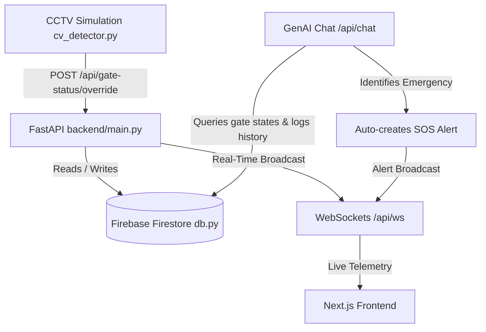

# FIFA 2026 Crowd Management Web Application (Etihad Stadium Model)

An enterprise-grade, real-time safety and crowd management system designed for the FIFA 2026 World Cup, modeling Etihad Stadium (Manchester) as the architectural blueprint. 

This full-stack system leverages **FastAPI WebSockets**, **Next.js App Router**, **YOLOv8 Computer Vision**, and a robust **Firebase Cloud Firestore database** to coordinate crowd flows, automate gate rerouting, handle SOS emergency alerts, and provide spectators with an interactive GenAI Safety Assistant.

---

## 🚀 System Architecture Overview

The application is structured into four main components working in unison:



1. **Next.js Frontend:** A responsive web portal featuring a Mobile-First Audience Portal (wayfinding, chat, notifications, SOS) and a Desktop Organizer Control Center (heatmap, stadium model, override controls, alert dispatcher).
2. **FastAPI Backend (`main.py`):** REST API and WebSockets dispatcher that acts as the central coordinator, database gateway, and GenAI client.
3. **Firebase Cloud Firestore (`db.py`):** Cloud-hosted NoSQL database handling real-time gate statuses, active and resolved SOS emergencies, and conversation logs.
4. **CCTV OpenCV Simulator (`cv_detector.py`):** Runs real-time person detection (via YOLOv8 or simulated mocks) on simulated security feeds to dynamically measure gate congestion and notify the backend.

---

## 🛠️ Technology Stack

| Layer | Technology | Purpose |
| :--- | :--- | :--- |
| **Frontend** | React / Next.js 14+ | App Router, responsive portals, dynamic SVG maps. |
| **Styling** | Tailwind CSS / CSS | UI layouts, responsive breakpoints, transitions. |
| **Backend** | FastAPI / Python 3.9+ | High-concurrency REST endpoints and WebSockets. |
| **Database** | Firebase Firestore | Cloud NoSQL database service. |
| **Computer Vision** | OpenCV & YOLOv8 | Camera crowd monitoring and person tracking. |
| **GenAI** | Groq (Llama 3.3 70B) | Contextual safety assistant & executive summarizer. |

---

## 📁 Repository Structure

```text
fifa-crowd-management/
├── README.md               # Detailed system overview and project specifications
├── SETUP.md                # Interactive, step-by-step setup and troubleshooting guide
├── run_local.bat           # 1-click Windows runner script (launches both servers)
├── backend/                # python FastAPI backend services
│   ├── main.py             # FastAPI REST router and WebSocket server
│   ├── db.py               # Firebase Firestore database helper & schema seeding
│   ├── cv_detector.py      # OpenCV + YOLOv8 camera simulator script
│   ├── mock_data.py        # Static coordinates & seating block metadata (Etihad Stadium)
│   ├── requirements.txt    # Python requirements manifest
│   ├── yolov8n.pt          # YOLOv8 nano model weights (downloaded on first run)
│   └── .env                # Secret keys configuration (Groq GenAI)
└── frontend/               # Next.js React frontend
    ├── package.json        # Node.js dependencies and run scripts
    ├── tailwind.config.ts  # Tailwind custom design tokens
    └── src/
        └── app/            # App Router pages (Audience, Organizer, Stadium Model)
```

---

## 🌟 Core Features

### 1. Dynamic SVG Seating & Wayfinding Map
* Implements an **exact landscape vector model of Etihad Stadium** (pitch, stands, gate coordinates).
* Renders **dynamic Bezier curve wayfinding paths** connecting spectators from their entry gate directly to their designated seating block.
* Automatically recalculates and updates paths in real-time when gate statuses change.

### 2. Live CCTV Computer Vision Integration
* Simulates live security camera feeds using OpenCV.
* Integrates a YOLOv8 object detection model to dynamically identify and track individuals entering gates.
* Automatically overrides gate operational states to `Crowded` in the database when crowd sizes exceed critical thresholds.

### 3. Emergency SOS Dispatch & Tracking
* Spectators can trigger immediate, pulsing SOS beacons on the organizer dashboard.
* Active incidents are kept in a live dispatch queue until organizers review and mark them as `Resolved`.
* Includes an audit-friendly unresolved archive to quickly reinstate active status.

### 4. Contextual GenAI Safety Assistant
* Fan chatbot powered by **Llama 3.3 70B** through Groq.
* Dynamically fetches stadium coordinates, gate wait times, medical tent locations, and water points to inject as system instructions.
* Automatically parses message intent: if a fan chats about a life-threatening situation (e.g. *"someone collapsed nearby"*), the AI triggers an **automatic database SOS alert** which immediately flashes on organizer screens.

---

## 🚦 Getting Started

To get the application up and running locally, please refer to the detailed **[SETUP.md](SETUP.md)**. 

*For Windows users, a convenience **[run_local.bat](run_local.bat)** script is available to set up environment dependencies and launch both servers simultaneously in a single click.*
